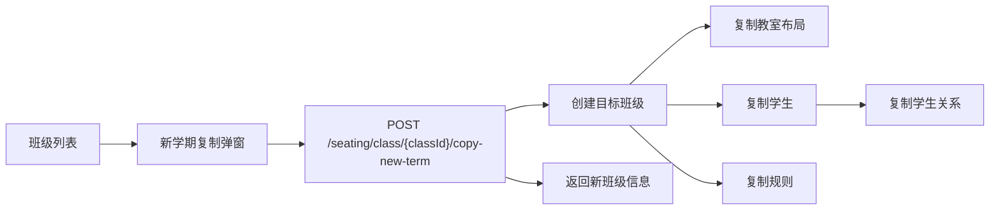

# 新学期复制创建设计说明

## 背景

阶段 9 的 `P2` 目标不是再补一个独立模板中心，而是把老师在新学期最常见的“从旧班级快速起新班级”流程做顺。

当前项目里已经有这些可复用能力：

- 班级管理已具备基础增删改查、学期字段、学段字段、科目快照和权限控制。
- 排座方案已经支持复制、确认启用、导出和历史差异查看。
- 学生、学生关系约束、排座规则、教室布局和座位位置都已经按班级维度建模。

所以这次只做一个闭环：从已有班级复制出新的新学期班级，并按勾选项复制相关基础数据。

## 目标

1. 让老师从班级列表直接发起“新学期复制创建”。
2. 默认复制学生、学生关系、排座规则、教室布局。
3. 不复制考试、成绩、座位方案、座位分配和方案评分。
4. 复制后的新班级能继续走现有的学生维护、教室布局调整和智能排座流程。

## 非目标

- 不做独立的班级模板管理页。
- 不做独立的规则模板中心。
- 不做考试批次、成绩、历史方案的迁移。
- 不调整排座算法本身。
- 不引入多学校、多租户或 AI 对话式排座。

## 方案概览

我建议把能力收敛为“班级列表中的一条复制入口 + 一个后端事务化复制接口”。

前端只负责选择源班级、填写目标班级信息和勾选复制项。后端负责一次性完成班级、学生、关系、规则和教室布局的复制，并保证任何一步失败都回滚。

## 用户流程

1. 老师在“班级管理”列表中点击某个班级的“新学期复制”。
2. 弹窗默认带出源班级信息，提示当前班级名称、年级、学段、学年和学期。
3. 弹窗中老师填写目标班级名称，选择目标学年和学期。
4. 复制项默认全部勾选：
   - 复制学生。
   - 复制学生关系。
   - 复制排座规则。
   - 复制教室布局。
5. 老师提交后，后端创建新班级并复制勾选项。
6. 成功后返回新班级信息，列表刷新。

## 前端设计

### 入口位置

文件：

- [`RuoYi-Vue3-master/src/views/seating/class/index.vue`](../../../../RuoYi-Vue3-master/src/views/seating/class/index.vue)
- [`RuoYi-Vue3-master/src/api/seating/class.js`](../../../../RuoYi-Vue3-master/src/api/seating/class.js)

在班级列表的行操作区新增按钮：

- 文案：`新学期复制`
- 权限：`seating:class:add`
- 交互：打开复制弹窗

### 弹窗字段

复制弹窗建议只保留这些字段：

- 源班级信息，只读展示。
- `className`，目标班级名称，必填。
- `schoolYear`，目标学年，必填。
- `semester`，目标学期，必填。
- `copyStudents`，默认勾选。
- `copyRelations`，默认勾选。
- `copyRules`，默认勾选。
- `copyClassroomLayout`，默认勾选。

约束：

- `copyRelations` 依赖 `copyStudents`，如果不复制学生，学生关系自动失效。
- 目标学年和学期默认按“下一个学期”预填，老师可以改。
- 班级名称不自动推断升班结果，先让老师自己决定，避免误判年级变化。

### 前端交互原则

- 复制成功后刷新列表，不强制跳转。
- 如果后端返回新班级 ID，列表可选中新记录，方便老师继续编辑。
- 复制弹窗不要暴露 `teacherId`、`deptId`、`delFlag` 这类内部字段。

## 后端设计

### 接口

文件：

- [`RuoYi-Vue-springboot3/ruoyi-admin/src/main/java/com/ruoyi/web/controller/seating/SeatClassController.java`](../../../../RuoYi-Vue-springboot3/ruoyi-admin/src/main/java/com/ruoyi/web/controller/seating/SeatClassController.java)
- [`RuoYi-Vue-springboot3/ruoyi-seating/src/main/java/com/ruoyi/seating/service/ISeatClassService.java`](../../../../RuoYi-Vue-springboot3/ruoyi-seating/src/main/java/com/ruoyi/seating/service/ISeatClassService.java)
- [`RuoYi-Vue-springboot3/ruoyi-seating/src/main/java/com/ruoyi/seating/service/impl/SeatClassServiceImpl.java`](../../../../RuoYi-Vue-springboot3/ruoyi-seating/src/main/java/com/ruoyi/seating/service/impl/SeatClassServiceImpl.java)

新增接口建议为：

- `POST /seating/class/{classId}/copy-new-term`

请求体建议新增一个专用 DTO：

- `SeatClassCopyRequest`

建议字段：

- `className`
- `schoolYear`
- `semester`
- `copyStudents`
- `copyRelations`
- `copyRules`
- `copyClassroomLayout`

### 复制顺序

后端建议用一个事务一次性完成复制，顺序如下：

1. 校验源班级存在且当前用户有权限操作。
2. 校验目标班级名称、学年和学期。
3. 复制源班级基础信息生成目标班级。
4. 复制教室布局。
5. 复制学生，并建立旧学生 ID 到新学生 ID 的映射。
6. 复制学生关系，使用新学生 ID 重建关系。
7. 复制排座规则。
8. 返回新班级信息。

### 基础数据继承规则

目标班级继承这些字段作为基础：

- `schoolStage`
- `gradeCode`
- `gradeName`
- `subjectSnapshot`
- `teacherId`
- `deptId`

目标班级重置这些字段：

- `classId`，由数据库生成。
- `createBy`、`createTime`，按当前操作人写入。
- `updateBy`、`updateTime`，保持空或由新增逻辑处理。
- `status`，默认启用。
- `delFlag`，默认存在。

目标学年和学期按源班级推导下一学期默认值：

- 如果源班级是上学期，则目标默认同年下学期。
- 如果源班级是下学期，则目标默认下一学年上学期。

### 学生复制规则

复制学生时：

- 以源班级学生为输入。
- 新学生挂到目标班级。
- 保留学生姓名、学号、性别、身高、纪律、排序号等业务字段。
- 不复制任何历史成绩数据。

### 学生关系复制规则

复制学生关系时：

- 只在学生复制成功后执行。
- 用旧学生 ID 到新学生 ID 的映射重建 `studentId` 和 `relatedId`。
- 关系类型和权重原样复制。
- 如果源班级没有关系记录，按空结果处理，不报错。

### 规则复制规则

复制排座规则时：

- 原样复制规则名称、分类、编码、权重、配置 JSON 和启用状态。
- 目标班级使用新的 `classId`。
- 如果源班级没有规则记录，按空结果处理，不报错。

### 教室布局复制规则

复制教室布局时：

- 默认只复制源班级当前启用的主布局。
- 同步复制座位行列、讲台位置、过道配置、默认标记和座位位置。
- 不复制任何座位分配结果。
- 如果源班级没有可用教室布局，而老师勾选了复制布局，则返回明确错误。

## 明确不复制的内容

以下内容都不进入新班级：

- 考试批次。
- 成绩记录。
- 排座方案。
- 座位分配结果。
- 方案评分明细。

这条是刻意的，因为新学期应该从新的考试和新的方案开始，避免历史数据污染新学期。

## 错误处理

建议的错误反馈：

- 源班级不存在或无权限时，直接报“班级不存在”或“无权操作该班级”。
- 目标班级名称为空时，直接提示必填。
- 源班级没有可复制的教室布局，但用户勾选了复制布局时，直接失败。
- 任一复制步骤失败时，整个事务回滚，不允许出现半成品班级。

## 验证标准

完成后至少满足这些标准：

1. 班级列表能看到“新学期复制”入口。
2. 复制弹窗默认勾选学生、关系、规则、教室布局。
3. 复制成功后能生成一个新班级。
4. 新班级里的学生、关系、规则、教室布局与源班级一致。
5. 新班级里没有考试、成绩、排座方案、座位分配和评分明细。
6. 后端编译通过，前端构建通过。
7. 真实浏览器里能走通一次完整复制闭环。

## 说明

这版设计故意不做“升班自动推断”。年级变化和学段变化先保留给老师在复制后手动调整，避免系统猜错。

如果后面确实有老师需要“复制后自动升年级”，那应该作为下一轮单独增强，而不是塞进这次基础复制流程里。
